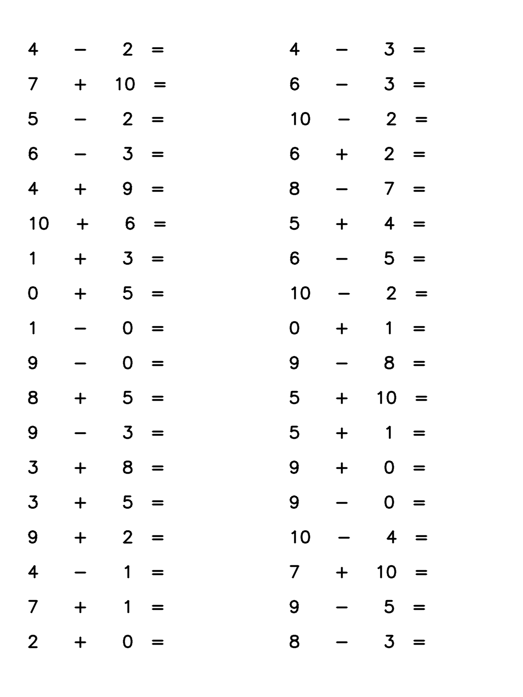

## Math exercise generator

The python program generates some arithmetic exercise for kid. You can specify the number of pages, the operators and the range of operands. 

## Usage
  * [optional] Change the parametors of generate_exercise.py if you want to change the range of operands or type of operators. 
  * run program by running ```python generate_exercise.py --pages=1 --first_max=10 --operators=+- --second_max=10``` or ```python generate_exercise.py --pages=1 --first_max=10 --operators=+- --second_max=10 --third_max=10```
  * each page has 36 equations.

## Generated exercise example.

